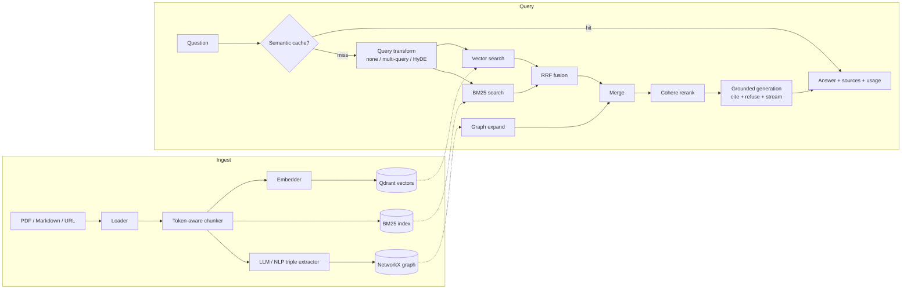
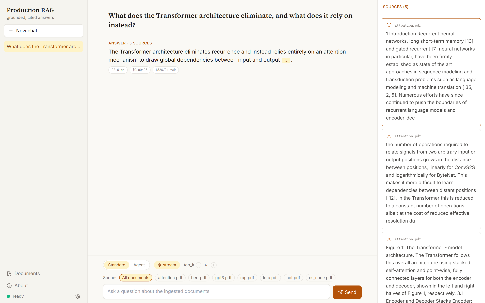
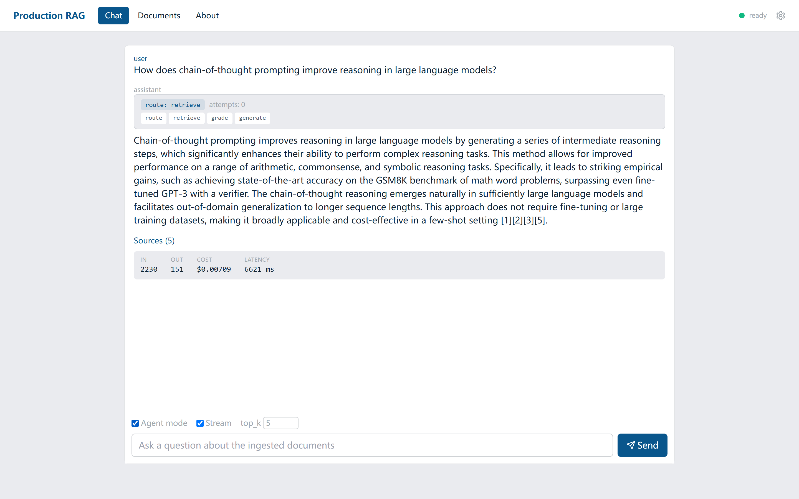

# Production RAG System

Production-grade Retrieval-Augmented Generation: hybrid retrieval (vector + BM25 + GraphRAG),
reranking, **grounded & cited generation with refusal**, real token streaming, per-query cost
tracking, a semantic cache, and a measurable evaluation harness — packaged for one-command
Docker deployment.

[](https://github.com/WeiGuang-2099/Production-RAG/actions/workflows/ci.yml)


> **Built test-first, then measured against real keys.** The eval surfaced 3 bugs 215 mocked
> tests couldn't, and showed standard RAGAS *penalizes correct refusals* — the wrong yardstick
> for a cite-or-refuse system. → [Read the case study](docs/CASE_STUDY.md).

## Why this project is different

Most RAG demos wire up LangChain and stop. This one is built like a service you would actually
run and improve:

- **Answers are grounded, cited, and willing to refuse.** The default prompt answers only from
  retrieved context, cites sources as `[n]`, and replies "I cannot answer this from the provided
  documents" instead of hallucinating. The eval set includes an `unanswerable` bucket that
  specifically tests this.
- **Quality is measured, not asserted.** A retrieval ablation (`baseline → +BM25 → +rerank →
  +graph`) reports recall@k / MRR / hit@k with no LLM judge, and RAGAS covers end-to-end answer
  quality. See [Evaluation](#evaluation).
- **Real production concerns are handled**: token streaming, per-query token/cost accounting,
  a semantic cache, bearer-token auth, rate limiting, structured JSON logging with request IDs,
  health/readiness probes, path-traversal-safe ingestion, and graceful degradation when a
  component fails.
- **Guardrails at the API edge.** Inputs are screened for prompt injection (blocked with
  `400`) and answers are scanned for PII (redacted) and toxicity (flagged) before they leave
  `/chat` and `/agent` — heuristic detectors (regex / wordlist, no heavy framework), toggled by
  `GUARDRAILS_ENABLED`. On the streaming endpoints the final answer is guarded, not each token.
- **Provider-agnostic by construction.** Config-driven factories pick the LLM / embedder /
  reranker; there is no `if provider == ...` scattered through the business logic.
- **Task-based model routing with fallback.** The agent's control-plane calls (route / grade /
  rewrite) run on a cheap fast model while answer generation uses the strong model, and any LLM
  call falls back to a same-provider model on error or timeout. Tuned via `LLM_MODEL_FAST` /
  `LLM_FALLBACK_MODEL` / `LLM_TIMEOUT`.

## Architecture



- **Ingest**: Loaders (PDF/MD/Web) → token-aware chunker → embedder → Qdrant + BM25 + knowledge graph
- **Query**: cache → query transform → vector+BM25 hybrid (RRF) → GraphRAG expand → rerank → grounded LLM generation
- **Config**: all behavior via `.env`, provider-agnostic factories
- **Observability**: LangSmith tracing + per-query token/cost logging

## Quick start

```bash
# 1. Configure
cp .env.example .env          # add your OpenAI + Cohere keys

# 2. Start API + Qdrant
docker-compose up -d

# 3. Ingest a document (must live under DATA_DIR)
curl -X POST http://localhost:8000/ingest \
  -H "Content-Type: application/json" \
  -d '{"source": "./data/papers/attention.pdf"}'

# 4. Ask a question (streaming)
curl -N -X POST http://localhost:8000/chat/stream \
  -H "Content-Type: application/json" \
  -d '{"question": "What does the Transformer eliminate?"}'
```

## Demo UI

A React single-page app (Vite + TypeScript) in `frontend/` exposes the full system: chat with live
token streaming and cited sources (persisted across navigation and reload), a per-document scope
picker that restricts retrieval to the selected files, agentic mode with a visible reasoning
trace, document upload/listing/deletion, and an architecture overview.

```bash
cd frontend
cp .env.example .env        # set VITE_API_URL to your backend (default http://localhost:8000)
npm install
npm run dev                 # http://localhost:5173

npm run build               # static assets in frontend/dist for Vercel/Netlify
```

The SPA calls the backend directly, so set the backend's `CORS_ORIGINS` to the SPA origin
(`http://localhost:5173` in dev). For an open public demo, run the backend with `API_KEY_HASH`
unset.

**Chat** — grounded answer with `[n]` citations and expandable source chunks (including a
knowledge-graph hit):



**Agent mode** — the corrective-RAG trace (`route → retrieve → grade → generate`) is shown above
the answer, with per-query token and cost accounting below it:



## Evaluation

Evaluation is **numbers, not adjectives** — and the story behind the numbers is the
[**case study**](docs/CASE_STUDY.md): what running the harness against real keys actually taught
me, including three production bugs 215 mocked tests missed and why standard RAGAS scores a
cite-or-refuse system *backwards*. **Start there.**

The corpus is 6 classic ML papers from arXiv and the dataset is 48 hand-written questions across
6 types (factual, multi-hop, comparative, numerical, unanswerable, long-tail); the harness itself
is documented in [`evaluation/README.md`](evaluation/README.md).

```bash
python evaluation/corpus/download_papers.py        # fetch the 6 papers
# ingest them (loop in evaluation/README.md), then:

# Cheap, deterministic retrieval ablation (no LLM judge):
python evaluation/run_ablation.py --k 5

# End-to-end RAGAS, comparing the grounded vs basic prompt:
PROMPT_MODE=basic    python evaluation/run_eval.py --label basic
PROMPT_MODE=grounded python evaluation/run_eval.py --label grounded
```

Real results (2026-06-22, 6-paper corpus, 479 chunks) — full breakdown and honest
interpretation in [`evaluation/results/`](evaluation/results/README.md).

**Retrieval ablation** — recall@5 over the reranked top-5; latency is retrieval-only
(includes the per-query embedding call):

| stage | recall@5 | mrr | hit@5 | p50_ms | p95_ms |
| --- | --- | --- | --- | --- | --- |
| baseline (dense)    | 0.934 | 0.979 | 1.000 | 1133 | 1783 |
| +bm25 (hybrid RRF)  | **0.972** | 0.958 | 1.000 | 1039 | 1640 |
| +rerank (Cohere)    | 0.962 | **0.979** | 1.000 | 1747 | 2067 |
| +graph              | 0.903 | 0.927 | 0.958 | 1773 | 2185 |

Honest read: on six topically distinct papers dense retrieval is already
near-ceiling (baseline hit@5 = 1.000), so the ablation measures *which knob moves
what*. **+BM25 maximizes recall@5** (0.934 → 0.972, no latency cost) but its RRF
reshuffle nudges MRR to 0.958; **+rerank trades a hair of recall (0.962) to restore
MRR to 0.979** — the single best chunk first — for ~0.7s of added p95; **+graph
actively hurts here** (recall 0.903, hit@5 0.958), as cross-paper expansion adds
noise on a small, well-separated corpus. So the hybrid+rerank defaults are
justified and graph is honestly flagged as not paying off at this scale.

**Scale robustness** — a second corpus adds 24 *adversarial* distractor papers
(RoBERTa/ALBERT vs BERT, DPR/FiD vs RAG, QLoRA vs LoRA, ...), growing the index
4.6x to 2,194 chunks with the same 48 questions. Recall holds (0.934, hit@5
1.000) but **ranking degrades** (MRR 0.979 → 0.844) — and the reranker becomes
the highest-value component, roughly doubling its MRR contribution while BM25's
recall edge nearly vanishes. Paired tables and the honest read in
[`evaluation/results/`](evaluation/results/README.md).

**Latency** — caching the stores (Qdrant connection, BM25 index, graph) and running the
retrieval legs in parallel is score-neutral by construction (identical RRF inputs; verified
per stage on both corpora) and roughly halves retrieval latency across the board — p50
~1.4s → ~0.64s for the full pipeline, with p95 down up to 2.5x. The per-query BM25 unpickle
grew with the corpus, so store caching also removes a scaling liability. Repeat questions
short-circuit through the semantic cache (Redis-backed when `REDIS_URL` is set) in ~0.2s:
before/after p50/p95 tables in [`evaluation/results/`](evaluation/results/README.md).

End-to-end (RAGAS, grounded vs basic), the result is more interesting than the
cliche: the grounded prompt **refuses 5/5 unanswerable questions** (basic 0/5),
yet standard RAGAS faithfulness/relevancy *penalize* that correct refusal — a
real measurement pitfall for cite-or-refuse systems that the
[results page](evaluation/results/README.md) digs into.

## Development

```bash
pip install -e ".[dev]"
ruff check .
pytest -q                                  # 245 tests, all mocked (no services needed)
pytest --cov=app --cov-report=term-missing
```

## Configuration

All via `.env` (see `.env.example` for the full annotated list).

| Variable | Default | Description |
|---|---|---|
| `LLM_PROVIDER` / `LLM_MODEL` | openai / gpt-4o | Chat model (openai / anthropic) |
| `LLM_MODEL_FAST` | gpt-4o-mini | Cheap model for agent control-plane calls (route / grade / rewrite) |
| `LLM_FALLBACK_MODEL` | gpt-4o-mini | Same-provider fallback on error/timeout (empty = disabled) |
| `LLM_TIMEOUT` | 30 | LLM request timeout in seconds |
| `EMBEDDING_MODEL` | text-embedding-3-small | Embedding model |
| `RERANKER_PROVIDER` | cohere | cohere / none |
| `PROMPT_MODE` | grounded | grounded (cite + refuse) / basic |
| `RETRIEVAL_MODE` | hybrid | hybrid (vector + BM25 RRF) / dense |
| `QUERY_TRANSFORM` | none | none / multi_query / hyde |
| `GRAPH_EXTRACTOR` | llm | llm / nlp / none |
| `CACHE_ENABLED` | false | semantic short-circuit cache |
| `REDIS_URL` | - | Redis backend for the semantic cache (empty = in-process; falls back on error) |
| `CHUNK_SIZE` / `CHUNK_OVERLAP` | 512 / 64 | token-based chunking |
| `TOP_K` / `RERANK_TOP_K` | 5 / 5 | retrieval depth / final context size |
| `API_KEY_HASH` | - | SHA256 of bearer token (empty = open) |
| `GUARDRAILS_ENABLED` | true | edge guardrails: prompt-injection block + PII redaction + toxicity flag |
| `MCP_ALLOW_INGEST` | true | expose the ingest (write) tool over the MCP server |
| `LANGSMITH_TRACING` | false | enable LangSmith tracing |

## API

| Method | Path | Purpose |
|---|---|---|
| POST | `/chat` | Answer with sources + token/cost usage; optional `sources` scopes retrieval to those documents |
| POST | `/chat/stream` | Token-by-token NDJSON stream |
| POST | `/agent` | Corrective-RAG agent answer with trace (route / steps / attempts); accepts `sources` too |
| POST | `/agent/stream` | Agent answer as an NDJSON stream |
| POST | `/ingest` | Ingest a PDF/Markdown file (under `DATA_DIR`) or URL |
| POST | `/ingest/upload` | Upload a PDF/Markdown file (multipart) and ingest it |
| GET | `/ingest/documents` | List ingested documents |
| DELETE | `/ingest/documents/{id}` | Remove an ingestion record |
| GET | `/health/live` · `/health/ready` | Liveness / readiness probes |

## MCP server

The same RAG engine is also exposed over the [Model Context Protocol](https://modelcontextprotocol.io)
(stdio, FastMCP), so MCP clients like Claude Desktop can drive it directly — no HTTP. It reuses the
pipeline, the corrective-RAG agent, and the guardrails in-process.

What it exposes:

- **Tools** — `search` (cited snippets, no generation), `ask` (corrective-RAG agent answer with
  citations), `ingest` (add a file/URL; gated by `MCP_ALLOW_INGEST`), `list_documents`.
- **Resource** — `rag://documents` (the ingested corpus as JSON).
- **Prompt** — `grounded_research` (a template that drives the tools toward a cited answer).

Run it (Qdrant must be running and a populated `.env` present, same config as the HTTP API):

```bash
pip install -e .          # exposes the `rag-mcp` console script
rag-mcp                   # or: python -m app.mcp_server
```

Wire it into Claude Desktop's `claude_desktop_config.json`:

```json
{
  "mcpServers": {
    "production-rag": {
      "command": "/path/to/.venv/bin/python",
      "args": ["-m", "app.mcp_server"],
      "cwd": "/path/to/production-rag"
    }
  }
}
```

(`cwd` lets the server find `.env`; alternatively pass the keys via an `"env"` block. On Windows use
the `\.venv\Scripts\python.exe` interpreter path.)

<!--  -->

## Tech stack

Python 3.11+, FastAPI, LangChain 0.3+, Qdrant (vectors), rank_bm25 (keyword), NetworkX (graph),
Cohere Rerank, tiktoken (token/cost accounting), RAGAS (eval), LangSmith (tracing), Docker Compose.

## Design notes & limitations

Deliberate trade-offs in the current implementation:

- **GraphRAG is intentionally lightweight.** Triples come from an LLM/NER pass and entity
  matching is lexical (n-gram + substring). It helps multi-hop questions but is not a full
  community-detection GraphRAG; that is the most natural next iteration.
- **The semantic cache is Redis-backed when `REDIS_URL` is set** (survives restarts, shared
  across replicas) and falls back to an in-process cache when Redis is absent or down. The
  semantic scan is linear over a 256-entry FIFO window — RediSearch KNN is the natural upgrade
  if the cache grows.
- **BM25 rebuilds on each ingest.** Fine for this corpus size; a production deployment would use
  an incremental index (e.g. OpenSearch).
- **Cost figures are estimates** from a static price table, not billed usage.
