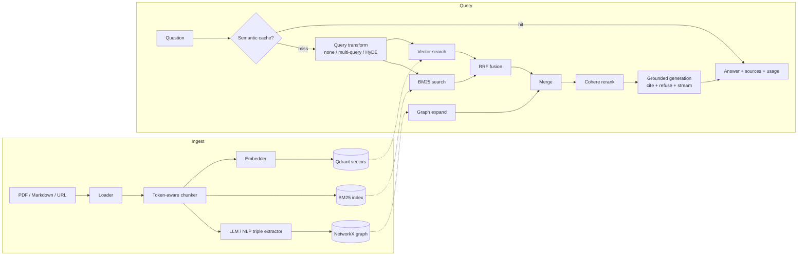

# Production RAG System

Production-grade Retrieval-Augmented Generation: hybrid retrieval (vector + BM25 + GraphRAG),
reranking, **grounded & cited generation with refusal**, real token streaming, per-query cost
tracking, a semantic cache, and a measurable evaluation harness — packaged for one-command
Docker deployment.


<!-- After pushing to GitHub, add the live CI badge:
 -->

> Built test-first (139 tests). Every retrieval/generation component is configurable and
> A/B-able through the evaluation harness, so design choices are backed by numbers rather than
> vibes.

## Why this project is different

Most RAG demos wire up LangChain and stop. This one is built like a service you would actually
run and improve:

- **Answers are grounded, cited, and willing to refuse.** The default prompt answers only from
  retrieved context, cites sources as `[n]`, and replies "I cannot answer this from the provided
  documents" instead of hallucinating. The eval set includes an `unanswerable` bucket that
  specifically tests this.
- **Quality is measured, not asserted.** A retrieval ablation (`baseline → +BM25 → +rerank →
  +graph`) reports recall@k / MRR / hit@k with no LLM judge, and RAGAS covers end-to-end answer
  quality. See [Evaluation](#evaluation).
- **Real production concerns are handled**: token streaming, per-query token/cost accounting,
  a semantic cache, bearer-token auth, rate limiting, structured JSON logging with request IDs,
  health/readiness probes, path-traversal-safe ingestion, and graceful degradation when a
  component fails.
- **Guardrails at the API edge.** Inputs are screened for prompt injection (blocked with
  `400`) and answers are scanned for PII (redacted) and toxicity (flagged) before they leave
  `/chat` and `/agent` — heuristic detectors (regex / wordlist, no heavy framework), toggled by
  `GUARDRAILS_ENABLED`. On the streaming endpoints the final answer is guarded, not each token.
- **Provider-agnostic by construction.** Config-driven factories pick the LLM / embedder /
  reranker; there is no `if provider == ...` scattered through the business logic.
- **Task-based model routing with fallback.** The agent's control-plane calls (route / grade /
  rewrite) run on a cheap fast model while answer generation uses the strong model, and any LLM
  call falls back to a same-provider model on error or timeout. Tuned via `LLM_MODEL_FAST` /
  `LLM_FALLBACK_MODEL` / `LLM_TIMEOUT`.

## Architecture



- **Ingest**: Loaders (PDF/MD/Web) → token-aware chunker → embedder → Qdrant + BM25 + knowledge graph
- **Query**: cache → query transform → vector+BM25 hybrid (RRF) → GraphRAG expand → rerank → grounded LLM generation
- **Config**: all behavior via `.env`, provider-agnostic factories
- **Observability**: LangSmith tracing + per-query token/cost logging

## Quick start

```bash
# 1. Configure
cp .env.example .env          # add your OpenAI + Cohere keys

# 2. Start API + Qdrant
docker-compose up -d

# 3. Ingest a document (must live under DATA_DIR)
curl -X POST http://localhost:8000/ingest \
  -H "Content-Type: application/json" \
  -d '{"source": "./data/papers/attention.pdf"}'

# 4. Ask a question (streaming)
curl -N -X POST http://localhost:8000/chat/stream \
  -H "Content-Type: application/json" \
  -d '{"question": "What does the Transformer eliminate?"}'
```

## Demo UI

A Streamlit chat UI with live token streaming, citation display, and a token/cost readout:

```bash
pip install -e ".[ui]"
streamlit run ui/streamlit_app.py     # point it at the API in the sidebar
```

<!-- Add a screenshot/GIF here for the recruiter skim:  -->

## Evaluation

The differentiator: **numbers, not adjectives.** The corpus is 6 classic ML papers from arXiv
and the dataset is 48 hand-written questions across 6 types (factual, multi-hop, comparative,
numerical, unanswerable, long-tail). See [`evaluation/README.md`](evaluation/README.md).

```bash
python evaluation/corpus/download_papers.py        # fetch the 6 papers
# ingest them (loop in evaluation/README.md), then:

# Cheap, deterministic retrieval ablation (no LLM judge):
python evaluation/run_ablation.py --k 5

# End-to-end RAGAS, comparing the grounded vs basic prompt:
PROMPT_MODE=basic    python evaluation/run_eval.py --label basic
PROMPT_MODE=grounded python evaluation/run_eval.py --label grounded
```

Results land in [`evaluation/results/`](evaluation/results/README.md) (the table to fill in once
you have run it against your keys).

## Development

```bash
pip install -e ".[dev]"
ruff check .
pytest -q                                  # 139 tests, all mocked (no services needed)
pytest --cov=app --cov-report=term-missing
```

## Configuration

All via `.env` (see `.env.example` for the full annotated list).

| Variable | Default | Description |
|---|---|---|
| `LLM_PROVIDER` / `LLM_MODEL` | openai / gpt-4o | Chat model (openai / anthropic) |
| `LLM_MODEL_FAST` | gpt-4o-mini | Cheap model for agent control-plane calls (route / grade / rewrite) |
| `LLM_FALLBACK_MODEL` | gpt-4o-mini | Same-provider fallback on error/timeout (empty = disabled) |
| `LLM_TIMEOUT` | 30 | LLM request timeout in seconds |
| `EMBEDDING_MODEL` | text-embedding-3-small | Embedding model |
| `RERANKER_PROVIDER` | cohere | cohere / none |
| `PROMPT_MODE` | grounded | grounded (cite + refuse) / basic |
| `RETRIEVAL_MODE` | hybrid | hybrid (vector + BM25 RRF) / dense |
| `QUERY_TRANSFORM` | none | none / multi_query / hyde |
| `GRAPH_EXTRACTOR` | llm | llm / nlp / none |
| `CACHE_ENABLED` | false | semantic short-circuit cache |
| `CHUNK_SIZE` / `CHUNK_OVERLAP` | 512 / 64 | token-based chunking |
| `TOP_K` / `RERANK_TOP_K` | 5 / 3 | retrieval depth / final context size |
| `API_KEY_HASH` | - | SHA256 of bearer token (empty = open) |
| `GUARDRAILS_ENABLED` | true | edge guardrails: prompt-injection block + PII redaction + toxicity flag |
| `LANGSMITH_TRACING` | false | enable LangSmith tracing |

## API

| Method | Path | Purpose |
|---|---|---|
| POST | `/chat` | Answer with sources + token/cost usage |
| POST | `/chat/stream` | Token-by-token NDJSON stream |
| POST | `/ingest` | Ingest a PDF/Markdown file or URL |
| GET | `/ingest/documents` | List ingested documents |
| DELETE | `/ingest/documents/{id}` | Remove an ingestion record |
| GET | `/health/live` · `/health/ready` | Liveness / readiness probes |

## Tech stack

Python 3.11+, FastAPI, LangChain 0.3+, Qdrant (vectors), rank_bm25 (keyword), NetworkX (graph),
Cohere Rerank, tiktoken (token/cost accounting), RAGAS (eval), LangSmith (tracing), Streamlit
(demo UI), Docker Compose.

## Design notes & limitations

Honest about the trade-offs, because an interviewer will ask:

- **GraphRAG is intentionally lightweight.** Triples come from an LLM/NER pass and entity
  matching is lexical (n-gram + substring). It helps multi-hop questions but is not a full
  community-detection GraphRAG; that is the most natural next iteration.
- **The cache is process-local.** Semantics match a Redis-backed cache, but state is lost on
  restart and not shared across replicas.
- **BM25 rebuilds on each ingest.** Fine for this corpus size; a production deployment would use
  an incremental index (e.g. OpenSearch).
- **Cost figures are estimates** from a static price table, not billed usage.
