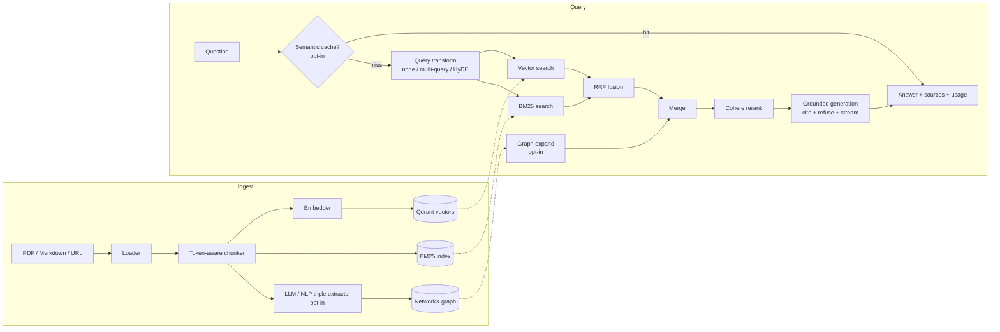

# Production RAG System

Retrieval-augmented question answering over a team's own documents, built around one rule in its
default (Standard) mode:
**cite the passages an answer comes from, or say the documents do not answer the question.**
It combines hybrid retrieval (vector + BM25, optional GraphRAG), Cohere reranking, token streaming,
per-answer cost estimates, a corrective-RAG agent that retries a weak search, input and output
guardrails, an MCP server and an evaluation harness that measures what each retrieval stage adds.

[](https://github.com/WeiGuang-2099/Production-RAG/actions/workflows/ci.yml)


> **Built test-first, then measured with live OpenAI and Cohere calls.** The eval surfaced 3 bugs
> the mocked unit tests missed, and showed that RAGAS faithfulness and answer relevancy score a
> refusal as zero, right or wrong, so they cannot be the only yardstick for a cite-or-refuse system.
> → [Read the case study](docs/CASE_STUDY.md).

## The problem it targets

Teams that answer questions from their own documents (support knowledge bases, product manuals,
internal policies, research collections) need answers a reader can check against the source, and a
plain "not in the documents" when the documents do not cover the question. The design assumes that
a confident wrong answer costs more than no answer.

Designed for one team's internal Q&A over curated PDF, Markdown or web pages with extractable text
(no OCR, no Office formats). Not a fit yet for open-ended chat, for answers that must combine several
documents (it refused 3 of the 7 test questions whose answer spans two or more papers), or for
non-English content (untested; the default keyword index splits on spaces and the guardrail patterns
are English).

**Status:** runs as a Docker Compose stack (API, Qdrant, Redis, OpenSearch) and has been evaluated
offline only: 48 hand-written questions plus 18 follow-ups over public ML papers standing in for a
team's documents (live OpenAI and Cohere calls, mostly single runs, 2026-06-22 to 2026-07-12). It has
not served real users; see [what a production rollout would still need](#what-a-production-rollout-would-still-need).

| What a team needs | What is built, and what was measured | Trade-off / limit |
| --- | --- | --- |
| **Answers a reader can check** | The default prompt asks for an `[n]` citation after each claim; in the UI, clicking one highlights its passage in a side panel | Citations are requested, not verified, and the panel shows only a passage's first 400 characters, which can cut off the supporting text |
| **"Not in the documents" instead of a guess** | In Standard mode (the UI default) it refused all 5 test questions the documents cannot answer, with 6 and with 30 papers indexed | Coverage: it also refused 10-15 of the 43 answerable questions (inferred from RAGAS scores; the harness does not save answers) |
| **The right document among look-alikes** | With 24 look-alike papers added (4.6x the chunks), dense retrieval still put a relevant paper in the top 5 for all 48 questions but ranked it lower (MRR, 1.0 when a relevant paper always ranks first: 0.979 → 0.844); reranking recovered part of it (0.877) | One Cohere call and ~0.3s per question |
| **Follow-up questions** | Follow-ups such as "what about its training cost?" are rewritten into standalone questions first: the right paper reached the top 5 for all 18 test follow-ups, up from 14 as typed | One gpt-4o-mini call per turn that carries chat history (in the UI, every turn after the first): ~0.85s median, 4.2s for the slowest of 18 |
| **A known price and speed per answer** | Each response reports tokens and an estimated cost for its answer call and any follow-up rewrite (\$0.00405 and \$0.00649 for the two gpt-4o answers in the screenshots); full answers took ~2.3-2.6s median, and retrieval alone later fell from ~1.4s to ~0.64s with identical scores | An undercount, not a bill: embeddings, reranking, the agent's route/grade/rewrite calls, opt-in multi-query/HyDE rewrites and indexing are not priced, and a cache hit repeats the original figures; no load test or measured cost per 1,000 questions yet |

Measurement conditions: the retrieval and follow-up rows scored the top 5 of 10 retrieved candidates
(all 10 reranked where reranking was on), with the local BM25 store (the API and UI retrieve 5 by
default; Compose uses OpenSearch). The refusal, RAGAS and full-answer latency runs had graph
expansion on, the default at the time. Agent mode, which can answer
a question it judges general without the documents, was not evaluated.

## Why this project is different

Most RAG demos wire up LangChain and stop. This one adds the basics a service needs to be operated,
measured and improved, listed below; what it still lacks for production is
[listed at the end](#what-a-production-rollout-would-still-need).

- **Answers are grounded, cited, and willing to refuse.** The default prompt tells the model to
  answer only from retrieved context, cite sources as `[n]`, and reply "I cannot answer this from
  the provided documents" when the context falls short (Agent mode can route general questions
  around retrieval). The eval set includes an `unanswerable` bucket that specifically tests this.
- **Quality is measured, not asserted.** A retrieval ablation (`baseline → +BM25 → +rerank →
  +graph`) reports recall@k / MRR / hit@k with no LLM judge; RAGAS adds LLM-judged end-to-end
  scores, with a blind spot for refusals. See [Evaluation](#evaluation).
- **Operational basics are built in**: token streaming, per-answer token/cost estimates, an
  opt-in semantic cache, bearer-token auth, rate limiting, structured JSON app logs with request
  IDs, liveness/readiness endpoints, path-traversal-safe ingestion, and graceful degradation when a
  component fails.
- **Guardrails at the API edge.** Inputs are screened for prompt injection (blocked with
  `400`) and answers are scanned for PII (redacted) and toxicity (flagged) before they leave
  `/chat` and `/agent` — heuristic detectors (regex / wordlist, no heavy framework), toggled by
  `GUARDRAILS_ENABLED`. On the streaming endpoints the final answer is guarded, not each token.
- **Provider-agnostic by construction.** Config-driven factories pick the LLM / embedder /
  reranker; there is no `if provider == ...` scattered through the business logic.
- **Task-based model routing with fallback.** The agent's control-plane calls (route / grade /
  rewrite) run on a fast model (gpt-4o-mini by default, 16.7x cheaper per token than gpt-4o in the
  repo's price table); answer generation falls back to a same-provider model on error or timeout
  (not yet on `/chat/stream`, the UI's default path). Tuned via `LLM_MODEL_FAST` / `LLM_FALLBACK_MODEL` / `LLM_TIMEOUT`.

## Architecture


```mermaid
flowchart LR
    subgraph Ingest
        A[PDF / Markdown / URL] --> B[Loader]
        B --> C[Token-aware chunker]
        C --> D[Embedder]
        D --> E[(Qdrant vectors)]
        C --> F[(BM25 index)]
        C --> G[LLM / NLP triple extractor<br/>opt-in] --> H[(NetworkX graph)]
    end

    subgraph Query
        Q[Question] --> K{Semantic cache?<br/>opt-in}
        K -- hit --> ANS[Answer + sources + usage]
        K -- miss --> QT[Query transform<br/>none / multi-query / HyDE]
        QT --> VS[Vector search]
        QT --> BM[BM25 search]
        VS --> RRF[RRF fusion]
        BM --> RRF
        GE[Graph expand<br/>opt-in] --> MG[Merge]
        RRF --> MG
        MG --> RR[Cohere rerank]
        RR --> GEN[Grounded generation<br/>cite + refuse + stream]
        GEN --> ANS
    end

    E -.-> VS
    F -.-> BM
    H -.-> GE
```

- **Ingest**: Loaders (PDF/MD/Web) → token-aware chunker → embedder → Qdrant + BM25 (+ knowledge graph, opt-in)
- **Query**: condense follow-up (history-aware, fast model) → cache (opt-in) → query transform → vector + keyword hybrid (RRF; pluggable keyword store: local BM25 or OpenSearch) → GraphRAG expand (opt-in) → rerank → grounded LLM generation
- **Config**: all behavior via `.env`, provider-agnostic factories
- **Observability**: opt-in LangSmith tracing, structured JSON app logs with request IDs, and
  per-answer token/cost estimates in every response

## Quick start

```bash
# 1. Configure
cp .env.example .env          # add your OpenAI + Cohere keys

# 2. Start the stack (API, Qdrant, Redis, OpenSearch)
docker-compose up -d

# 3. Upload a document (here the Transformer paper from arXiv)
curl -L -o attention.pdf https://arxiv.org/pdf/1706.03762
curl -F "file=@attention.pdf" http://localhost:8000/ingest/upload

# 4. Ask a question (streaming)
curl -N -X POST http://localhost:8000/chat/stream \
  -H "Content-Type: application/json" \
  -d '{"question": "What does the Transformer architecture eliminate, and what does it rely on instead?"}'
```

## Demo UI

A React single-page app (Vite + TypeScript) in `frontend/` exposes the full system: chat with live
token streaming and cited sources (persisted across navigation and reload), a per-document scope
picker that restricts retrieval to the selected files, an Agent mode with a visible step
trace, document upload, listing and record removal, and an architecture overview.

```bash
cd frontend
cp .env.example .env        # set VITE_API_URL to your backend (default http://localhost:8000)
npm install
npm run dev                 # http://localhost:5173

npm run build               # static assets in frontend/dist for Vercel/Netlify
```

The SPA calls the backend directly, so set the backend's `CORS_ORIGINS` to the SPA origin
(`http://localhost:5173` in dev). Auth is all-or-nothing: with `API_KEY_HASH` unset, as for an
open demo, anyone can also ingest files or URLs, remove records and spend your API budget.

**Chat** — grounded answer with `[n]` citations linked to a source panel:


**Agent mode** — the corrective-RAG trace (`route → retrieve → grade → generate`) is shown above
the answer, with the answer call's tokens and estimated cost below it:


## Evaluation

Evaluation is **numbers, not adjectives** — and the story behind the numbers is the
[**case study**](docs/CASE_STUDY.md): what running the harness against real keys actually taught
me, including three bugs the mocked unit tests missed and why standard RAGAS misreads a
cite-or-refuse system. **Start there**; where the two differ, this README is current.

The corpus is 6 classic ML papers from arXiv and the dataset is 48 hand-written questions across
6 types (factual, multi-hop, comparative, numerical, unanswerable, long-tail); the harness itself
is documented in [`evaluation/README.md`](evaluation/README.md).

```bash
python evaluation/corpus/download_papers.py        # fetch the 6 papers
# ingest in-process (needs only Qdrant); llm builds the graph the +graph row needs
GRAPH_EXTRACTOR=llm python evaluation/ingest_corpus.py

# Cheap, deterministic retrieval ablation (no LLM judge):
python evaluation/run_ablation.py --k 5

# End-to-end RAGAS, grounded vs basic prompt (the published runs had graph expansion on;
# prefix GRAPH_EXTRACTOR=llm to match them):
PROMPT_MODE=basic    python evaluation/run_eval.py --label basic
PROMPT_MODE=grounded python evaluation/run_eval.py --label grounded
```

Real results (2026-06-22, 6-paper corpus, 479 chunks) — full breakdown and honest
interpretation in [`evaluation/results/`](evaluation/results/README.md).

**Retrieval ablation** — recall@5 over the top 5 of 10 retrieved candidates (API/UI default: 5);
retrieval-only latency, including the embedding call, from before the 2026-07-10 speed-up:

| stage | recall@5 | mrr | hit@5 | p50_ms | p95_ms |
| --- | --- | --- | --- | --- | --- |
| baseline (dense)    | 0.934 | 0.979 | 1.000 | 1133 | 1783 |
| +bm25 (hybrid RRF)  | **0.972** | 0.958 | 1.000 | 1039 | 1640 |
| +rerank (Cohere)    | 0.962 | **0.979** | 1.000 | 1747 | 2067 |
| +graph              | 0.903 | 0.927 | 0.958 | 1773 | 2185 |

Honest read: on six topically distinct papers dense retrieval is already
near-ceiling (baseline hit@5 = 1.000), so the ablation measures *which knob moves
what*. **+BM25 maximizes recall@5** (0.934 → 0.972, no latency cost) but its RRF
reshuffle nudges MRR to 0.958; **+rerank trades a hair of recall (0.962) to restore
MRR to 0.979** — the single best chunk first — for ~0.7s of added p50 in this run (0.30-0.36s in
every later run); **+graph actively hurts** (recall 0.903, hit@5 0.958): its hits are
extracted triples that no metric or reader can trace to a document, and each one in the top 5
pushes out a citable chunk. So hybrid+rerank is the shipped default, and graph expansion is off by default.

**Scale robustness** — a second corpus adds 24 *adversarial* distractor papers
(RoBERTa/ALBERT vs BERT, DPR/FiD vs RAG, QLoRA vs LoRA, ...), growing the index
4.6x to 2,194 chunks with the same 48 questions. Recall holds (0.934, hit@5
1.000) but **ranking degrades** (MRR 0.979 → 0.844) — and the reranker becomes
the highest-value component, roughly doubling its MRR contribution while BM25's
recall edge nearly vanishes. Paired tables and the honest read in
[`evaluation/results/`](evaluation/results/README.md).

**Latency** — caching the stores (Qdrant connection, BM25 index, graph) and running the
retrieval legs in parallel is score-neutral by construction (identical RRF inputs; verified
per stage on both corpora) and roughly halves retrieval latency across the board — p50
~1.4s → ~0.64s for the full retrieval path, with p95 down 1.8-3x. The per-query BM25 unpickle
grew with the corpus, so store caching also removes a scaling liability. With
`CACHE_ENABLED=true`, repeat questions to `POST /chat` short-circuit through the semantic cache
(Redis-backed when `REDIS_URL` is set) in ~0.2s:
before/after p50/p95 tables in [`evaluation/results/`](evaluation/results/README.md).

**Keyword backend** — swapping the local `rank_bm25` store for OpenSearch (standard analyzer)
tests whether the naive `lower().split()` tokenization caused BM25's vanishing recall edge at
30-paper scale: it did not — the edge stays gone (+0.007 local vs +0.000 OpenSearch over the
dense baseline), so the vanishing edge is a property of the corpus at scale, not a tokenization
artifact. Paired local-vs-OpenSearch tables in
[`evaluation/results/`](evaluation/results/README.md).

**Multi-turn** — follow-up questions with pronouns ("what about its training cost?") used to
retrieve against the raw text and miss. A fast-model condense-question step now rewrites them
into standalone questions before the cache and retrieval — generation never sees the history, so
the cite-or-refuse contract stays single-turn. Measured on 18 hand-written follow-ups:
recall@5 0.778 raw → 1.000 condensed (hand-written oracle 1.000), ~0.85s p50 added
per turn that carries chat history. Three-condition table in
[`evaluation/results/`](evaluation/results/README.md).

End-to-end (RAGAS, grounded vs basic; graph expansion on, the default then), the grounded prompt **refuses 5/5 unanswerable
questions** at both corpus sizes, yet RAGAS faithfulness/relevancy score any refusal as zero,
right or wrong. At 6 papers those five explain about a quarter of grounded's lower faithfulness
(0.534 vs 0.878); most of the rest sits on 15 of 43 answerable questions with the same zero/zero
pattern (the harness does not save answers, so these were not read one by one). Refusals and answers need separate scores;
per-type tables, with an older reading of this gap, are on the [results page](evaluation/results/README.md).

## Development

```bash
pip install -e ".[dev]"
ruff check .
pytest -q                                  # 300 tests, all mocked (no services needed)
pytest --cov=app --cov-report=term-missing
```

## Configuration

All via `.env` (see `.env.example` for the full annotated list).

| Variable | Default | Description |
|---|---|---|
| `LLM_PROVIDER` / `LLM_MODEL` | openai / gpt-4o | Chat model (openai / anthropic) |
| `LLM_MODEL_FAST` | gpt-4o-mini | Cheap model for agent control-plane calls (route / grade / rewrite) |
| `LLM_FALLBACK_MODEL` | gpt-4o-mini | Same-provider fallback on error/timeout (empty = disabled) |
| `LLM_TIMEOUT` | 30 | LLM request timeout in seconds |
| `EMBEDDING_MODEL` | text-embedding-3-small | Embedding model |
| `RERANKER_PROVIDER` | cohere | cohere / none |
| `PROMPT_MODE` | grounded | grounded (cite + refuse) / basic |
| `RETRIEVAL_MODE` | hybrid | hybrid (vector + BM25 RRF) / dense |
| `QUERY_TRANSFORM` | none | none / multi_query / hyde |
| `GRAPH_EXTRACTOR` | none | none / llm / nlp (graph expansion is opt-in; it lowered retrieval scores in the eval) |
| `CACHE_ENABLED` | false | semantic short-circuit cache |
| `REDIS_URL` | - | Redis backend for the semantic cache (empty, or unreachable when the cache is first used = in-process) |
| `KEYWORD_BACKEND` | local | keyword store: local (rank_bm25, zero-dep) / opensearch (incremental, shared) |
| `OPENSEARCH_URL` / `OPENSEARCH_INDEX` | localhost:9200 / rag_chunks | OpenSearch endpoint and index name |
| `HISTORY_CONDENSE_ENABLED` | true | rewrite follow-ups into standalone questions using chat history (fast model) |
| `CHAT_HISTORY_MAX_TURNS` / `CHAT_HISTORY_MAX_TURN_CHARS` | 10 / 2000 | server-side history trimming caps |
| `CHUNK_SIZE` / `CHUNK_OVERLAP` | 512 / 64 | token-based chunking |
| `TOP_K` / `RERANK_TOP_K` | 5 / 5 | retrieval depth / final context size |
| `API_KEY_HASH` | - | SHA256 of bearer token (empty = open) |
| `GUARDRAILS_ENABLED` | true | edge guardrails: prompt-injection block + PII redaction + toxicity flag |
| `MCP_ALLOW_INGEST` | true | expose the ingest (write) tool over the MCP server |
| `LANGSMITH_TRACING` | false | enable LangSmith tracing |

## API

| Method | Path | Purpose |
|---|---|---|
| POST | `/chat` | Answer with sources + token/cost usage; optional `sources` scopes retrieval, optional `history` condenses follow-ups |
| POST | `/chat/stream` | Token-by-token NDJSON stream |
| POST | `/agent` | Corrective-RAG agent answer with trace (route / steps / attempts); accepts `sources` and `history` too |
| POST | `/agent/stream` | Agent answer as an NDJSON stream |
| POST | `/ingest` | Ingest a PDF/Markdown file (under `DATA_DIR`) or URL |
| POST | `/ingest/upload` | Upload a PDF/Markdown file (multipart) and ingest it |
| GET | `/ingest/documents` | List ingested documents |
| DELETE | `/ingest/documents/{id}` | Remove an ingestion record |
| GET | `/health/live` · `/health/ready` | Liveness / readiness probes |

## MCP server

The same RAG engine is also exposed over the [Model Context Protocol](https://modelcontextprotocol.io)
(stdio, FastMCP), so MCP clients like Claude Desktop can drive it directly — no HTTP. It reuses the
pipeline, the corrective-RAG agent, and the guardrails in-process.

What it exposes:

- **Tools** — `search` (cited snippets, no generation), `ask` (corrective-RAG agent answer, cited when it
  retrieves), `ingest` (add a file/URL; gated by `MCP_ALLOW_INGEST`), `list_documents`.
- **Resource** — `rag://documents` (the ingested corpus as JSON).
- **Prompt** — `grounded_research` (a template that drives the tools toward a cited answer).

Run it (Qdrant must be running and a populated `.env` present, same config as the HTTP API):

```bash
pip install -e .          # exposes the `rag-mcp` console script
rag-mcp                   # or: python -m app.mcp_server
```

Wire it into Claude Desktop's `claude_desktop_config.json`:

```json
{
  "mcpServers": {
    "production-rag": {
      "command": "/path/to/.venv/bin/python",
      "args": ["-m", "app.mcp_server"],
      "cwd": "/path/to/production-rag"
    }
  }
}
```

(`cwd` lets the server find `.env`; alternatively pass the keys via an `"env"` block. On Windows use
the `\.venv\Scripts\python.exe` interpreter path.)

<!--  -->

## Tech stack

Python 3.11+, FastAPI, LangChain 0.3+, Qdrant (vectors), rank_bm25 / OpenSearch (keyword, pluggable), NetworkX (graph),
Cohere Rerank, tiktoken (token/cost accounting), RAGAS (eval), LangSmith (tracing), Docker Compose.

## Design notes & limitations

Deliberate trade-offs in the current implementation:

- **GraphRAG is intentionally lightweight** (LLM/NER triples, lexical entity matching, no community
  detection). In aggregate it lowered recall@5, MRR and hit@5 at both corpus sizes (multi-hop alone
  is unmeasured), and the `llm` extractor costs one gpt-4o call per chunk at ingest, so it is off by
  default (`GRAPH_EXTRACTOR=llm` or `nlp` turns it on).
- **The semantic cache is opt-in (`CACHE_ENABLED`) and serves `POST /chat` only.** It is
  Redis-backed when `REDIS_URL` is set (survives restarts, shared across replicas), in-process if
  Redis is unreachable when the cache is first used (a later outage turns lookups into misses), and
  not invalidated on ingest; the scan is linear over a 256-entry FIFO window — RediSearch KNN is the
  natural upgrade if the cache grows.
- **The keyword store is pluggable: local `rank_bm25` (default, zero-dep) or OpenSearch
  (`KEYWORD_BACKEND=opensearch`).** The local store rebuilds its index on each ingest — fine at
  demo scale; the OpenSearch backend indexes incrementally, shares state across processes, and
  removes the scale ceiling. A dead OpenSearch degrades the keyword leg to vector-only results.
- **Multi-turn is condense-only: generation never sees the history.** Follow-ups are rewritten
  into standalone questions by a fast model; facts can only come from retrieved context, so the
  cite-or-refuse contract stays single-turn and auditable. Rewrite-type follow-ups ("explain that
  more simply") condense poorly — a documented trade-off, not a bug.
- **Cost figures are price-table estimates for the answer call and any follow-up rewrite only**;
  the cost row in [The problem it targets](#the-problem-it-targets) lists what is left out.

## What a production rollout would still need

Known gaps, each checked against the code, roughly in the order a pilot would meet them:

- **Evidence on your own documents.** Tag real questions with the file names (without extension) of
  the documents that answer them and run `python evaluation/run_ablation.py --dataset your_questions.json`;
  scoring answers and refusals also needs the answers saved, which the harness does not do yet.
- **Deletion and versions.** Removing a document only deletes its entry in the document list: its
  passages stay searchable and citable. An edited re-upload is indexed next to the old text, and
  re-ingesting the same URL or path is skipped while its record exists (removing the record first
  only adds the new text beside the old), so a changed page is never cleanly refreshed.
- **Access control and spend.** One shared bearer token (off by default) covers asking, ingesting and
  removing; there are no users, roles, per-document permissions or spend caps.
- **Data handling.** Questions and document text go to OpenAI and Cohere by default; only the final
  answer is PII-redacted, so source passages and streamed tokens are shown as-is, and the app logs
  record the first 100 characters of each `POST /chat` question, plus the first 80 characters of
  each condensed follow-up and its rewrite on `POST /chat` and `POST /agent`.
- **Untrusted content.** URL ingestion fetches any http(s) address from the server, internal
  addresses included (no SSRF guard), and ingested text reaches the prompt without the injection
  check that questions get.
- **Repeatable answers.** No temperature is set, so generation samples at the provider's default: a
  borderline question can be answered on one run and refused on the next.
- **Monitoring and capacity.** Responses do not flag refusals, retrieval fallbacks (such as unranked
  results when reranking fails) or cache hits (a generation fallback shows only as a different
  `usage.model`); there is no load test, latency or uptime target (SLO) or audit log;
  graph extraction, when enabled, runs inside the ingest request (479 chunks took ~32 minutes).
