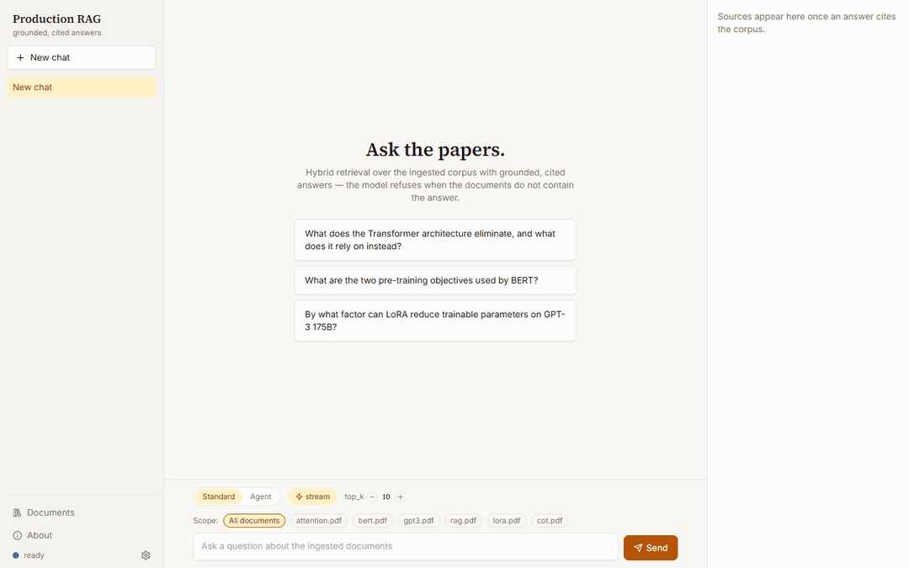
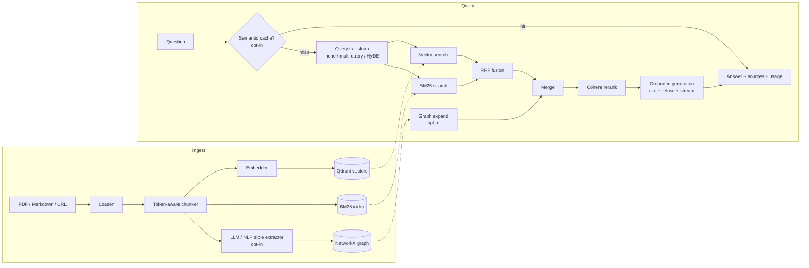
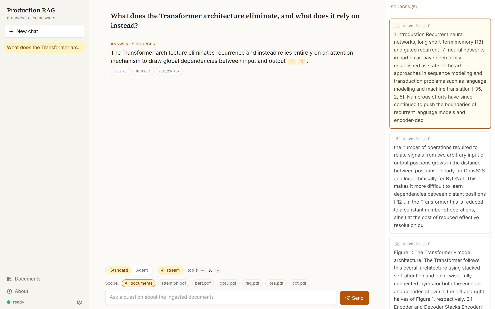
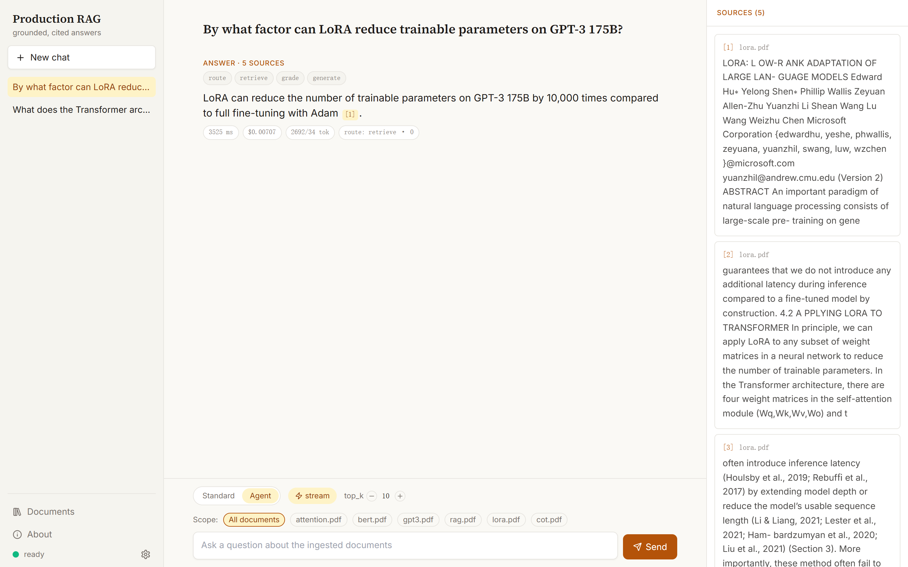

# Production RAG System

Retrieval-augmented question answering over a team's own documents, built around one rule in its
default (Standard) mode:
**cite the passages an answer comes from, or say the documents do not answer the question.**
It combines hybrid retrieval (vector + BM25, optional GraphRAG), Cohere reranking, token streaming,
per-answer cost estimates, a corrective-RAG agent that retries a weak search, input and output
guardrails, an MCP server and an evaluation harness that measures what each retrieval stage adds.

[](https://github.com/WeiGuang-2099/Production-RAG/actions/workflows/ci.yml)


> **Built test-first, then measured with live OpenAI and Cohere calls.** An answer-contract eval
> found the shipped configuration refusing about a third of answerable questions. Choosing the
> passages from 10 candidates instead of 5 cut that to about a fifth under the same all-or-nothing
> refusal rule; a prompt that answers in part and names what is missing cut it to 2 of 43, the same
> in two sessions, while all 27 questions the documents cannot answer were still declined in every
> run. Live runs also caught bugs the mocked tests could not, from a reranker that failed silently
> twice (the harness now stops on a failed rerank call) to a Compose stack that never started.
> → [Read the case study](docs/CASE_STUDY.md).



## The problem it targets

Teams that answer questions from their own documents (support knowledge bases, product manuals,
internal policies, research collections) need answers a reader can check against the source, and a
plain "not in the documents" when the documents do not cover the question. The design assumes that
a confident wrong answer costs more than no answer.

Designed for one team's internal Q&A over curated PDF, Markdown or web pages with extractable text
(no OCR, no Office formats). Not a fit yet for open-ended chat or non-English content (untested;
the default keyword index and the guardrail patterns are English-oriented). Answers that combine
several documents work but are weaker than single-paper ones: of the 7 test questions whose answer
spans two or more papers, the default configuration answered 6 in every pass, 4 of them fully
correct (57% of these answers judged correct and 14% refused, against 72-74% and 3% for
single-paper questions).

**Status:** runs as a Docker Compose stack (API, Qdrant, Redis, OpenSearch) and has been evaluated
offline only: 48 hand-written questions, 22 near-miss questions the papers cannot answer and 18
follow-ups, over public ML papers standing in for a team's documents (live OpenAI and Cohere calls,
2026-06-22 to 2026-10-08). It has not served real users; see
[what a production rollout would still need](#what-a-production-rollout-would-still-need).

| What a team needs | What is built, and what was measured | Trade-off / limit |
| --- | --- | --- |
| **Answers a reader can check** | The default prompt asks for an `[n]` citation after each claim; in the UI, clicking one highlights its passage in a side panel. In the eval every answer carried a citation, all pointing at a returned passage | Citations are requested, not verified, and the panel shows only a passage's first 400 characters, which can cut off the supporting text |
| **"Not in the documents" instead of a guess** | In Standard mode (the UI default) it declined all 27 test questions the documents cannot answer, in every run, and refused 2 of 43 answerable ones (4.7%, the same two in two sessions; 31.8% as first shipped; see [Evaluation](#evaluation)) | The 2 it still refuses, in every pass, are one cross-paper comparison (the other 6 multi-paper questions are answered) and one question that presupposes a single value of K, which the paper does not use (its reference answer was also wrong until dataset v1.1); about a quarter of answers are judged only partially correct against the reference |
| **The right document among look-alikes** | With 24 look-alike papers added (4.6x the chunks), dense retrieval still put a relevant paper in the top 5 for all 48 questions but ranked it lower (MRR, 1.0 when a relevant paper always ranks first: 0.979 → 0.844); reranking won back little of it (0.862) | One Cohere call and ~0.3s per question; keyword search slightly hurts here (one of 48 questions lost its paper from the top 5), likely because look-alike papers repeat names like "BERT" |
| **Follow-up questions** | Follow-ups such as "what about its training cost?" are rewritten into standalone questions first: the right paper reached the top 5 for all 18 test follow-ups, up from 14 as typed | One gpt-4o-mini call per turn that carries chat history (in the UI, every turn after the first): ~0.85s median, 4.2s for the slowest of 18 |
| **A known price and speed per answer** | Measured over every model, rerank and embedding call: \$8.47 per 1,000 questions in Standard mode (\$10.77 in Agent mode), with full answers at 1.3s median in both sessions, p95 2.7s one question at a time and 3.6s with 4 in flight | Each response still reports only its answer call (plus any follow-up rewrite), and a cache hit repeats the original figures; no load test yet |

Measurement conditions: the contract numbers are 3 passes per question at temperature 0 with the
shipped defaults (10 candidates reranked to 5, local BM25, graph off) on the 6-paper corpus,
labeled by a gpt-4o judge, from runs on 2026-10-07 and 2026-10-08 in which every rerank call
succeeded (the five reranker-off runs of 2026-10-07 are reported separately). The exception is the
31.8% as-first-shipped figure: provider-default temperature, 5 candidates, the strict prompt and
the old tokenizer. Latency was measured one question at a time on 2026-10-07 and with 4 questions
in flight on 2026-10-08 (Agent mode always runs one at a time). The
look-alike and follow-up rows score the top 5 of 10 reranked candidates on the local BM25 store
(Compose uses OpenSearch); the follow-up row comes from a 2026-07-12 run, before the BM25 tokenizer
fix.
Earlier RAGAS runs (June-July) had graph expansion on.

## Why this project is different

Most RAG demos wire up LangChain and stop. This one adds the basics a service needs to be operated,
measured and improved, listed below; what it still lacks for production is
[listed at the end](#what-a-production-rollout-would-still-need).

- **Answers are grounded, cited, and willing to refuse.** The default prompt tells the model to
  answer only from retrieved context, cite sources as `[n]`, and reply "I cannot answer this from
  the provided documents" when nothing in the context answers, saying what is missing when only
  part is covered (Agent mode can route general questions around retrieval). 27 unanswerable eval
  questions test this.
- **Quality is measured, not asserted.** A retrieval ablation (`baseline → +BM25 → +rerank →
  +graph`) reports recall@k / MRR / hit@k with no LLM judge, and an answer-contract eval checks
  that it answers what the documents support and refuses the rest. See [Evaluation](#evaluation).
- **Operational basics are built in**: token streaming, per-answer token/cost estimates, an
  opt-in semantic cache, bearer-token auth, rate limiting, structured JSON app logs with request
  IDs, liveness/readiness endpoints, path-traversal-safe ingestion, and graceful degradation when a
  component fails.
- **Guardrails at the API edge.** Inputs are screened for prompt injection (blocked with
  `400`) and answers are scanned for PII (redacted) and toxicity (flagged) before they leave
  `/chat` and `/agent` — heuristic detectors (regex / wordlist, no heavy framework), toggled by
  `GUARDRAILS_ENABLED`. On the streaming endpoints the final answer is guarded, not each token.
- **Provider-agnostic by construction.** Config-driven factories pick the LLM / embedder /
  reranker; there is no `if provider == ...` scattered through the business logic.
- **Task-based model routing with fallback.** The agent's control-plane calls (route / grade /
  rewrite) run on a fast model (gpt-4o-mini by default, 16.7x cheaper per token than gpt-4o in the
  repo's price table); answer generation falls back to a same-provider model on error or timeout
  (not yet on `/chat/stream`, the UI's default path). Tuned via `LLM_MODEL_FAST` / `LLM_FALLBACK_MODEL` / `LLM_TIMEOUT`.

## Architecture


```mermaid
flowchart LR
    subgraph Ingest
        A[PDF / Markdown / URL] --> B[Loader]
        B --> C[Token-aware chunker]
        C --> D[Embedder]
        D --> E[(Qdrant vectors)]
        C --> F[(BM25 index)]
        C --> G[LLM / NLP triple extractor<br/>opt-in] --> H[(NetworkX graph)]
    end

    subgraph Query
        Q[Question] --> K{Semantic cache?<br/>opt-in}
        K -- hit --> ANS[Answer + sources + usage]
        K -- miss --> QT[Query transform<br/>none / multi-query / HyDE]
        QT --> VS[Vector search]
        QT --> BM[BM25 search]
        VS --> RRF[RRF fusion]
        BM --> RRF
        GE[Graph expand<br/>opt-in] --> MG[Merge]
        RRF --> MG
        MG --> RR[Cohere rerank]
        RR --> GEN[Grounded generation<br/>cite + refuse + stream]
        GEN --> ANS
    end

    E -.-> VS
    F -.-> BM
    H -.-> GE
```

- **Ingest**: Loaders (PDF/MD/Web) → token-aware chunker → embedder → Qdrant + BM25 (+ knowledge graph, opt-in)
- **Query**: condense follow-up (history-aware, fast model) → cache (opt-in) → query transform → vector + keyword hybrid (RRF; pluggable keyword store: local BM25 or OpenSearch) → GraphRAG expand (opt-in) → rerank → grounded LLM generation
- **Config**: all behavior via `.env`, provider-agnostic factories
- **Observability**: opt-in LangSmith tracing, structured JSON app logs with request IDs, and
  per-answer token/cost estimates in every response

## Quick start

```bash
# 1. Configure
cp .env.example .env          # add your OpenAI + Cohere keys

# 2. Start the stack (API, Qdrant, Redis, OpenSearch)
docker-compose up -d

# 3. Upload a document (here the Transformer paper from arXiv)
curl -L -o attention.pdf https://arxiv.org/pdf/1706.03762
curl -F "file=@attention.pdf" http://localhost:8000/ingest/upload

# 4. Ask a question (streaming)
curl -N -X POST http://localhost:8000/chat/stream \
  -H "Content-Type: application/json" \
  -d '{"question": "What does the Transformer architecture eliminate, and what does it rely on instead?"}'
```

## Demo UI

A React single-page app (Vite + TypeScript) in `frontend/` exposes the full system: chat with live
token streaming and cited sources (persisted across navigation and reload), a per-document scope
picker that restricts retrieval to the selected files, an Agent mode with a visible step
trace, document upload, listing and record removal, and an architecture overview.

```bash
cd frontend
cp .env.example .env        # set VITE_API_URL to your backend (default http://localhost:8000)
npm install
npm run dev                 # http://localhost:5173

npm run build               # static assets in frontend/dist for Vercel/Netlify
```

The SPA calls the backend directly, so set the backend's `CORS_ORIGINS` to the SPA origin
(`http://localhost:5173` in dev). Auth is all-or-nothing: with `API_KEY_HASH` unset, as for an
open demo, anyone can also ingest files or URLs, remove records and spend your API budget.

**Chat:** a grounded answer with `[n]` citations linked to a source panel.



**Agent mode:** the corrective-RAG trace (`route → retrieve → grade → generate`) above the answer,
with the answer call's latency, tokens and estimated cost below it.



## Evaluation

Evaluation is numbers, not adjectives. The [case study](docs/CASE_STUDY.md) tells the story behind
them: what running the harness against live APIs taught me, the bugs that only showed up that way,
and how a refusal problem was traced to too few retrieval candidates and an all-or-nothing refusal
rule. Harness details are in [`evaluation/README.md`](evaluation/README.md), and every report is in
[`evaluation/results/`](evaluation/results/README.md).

The corpus is 6 classic ML papers from arXiv (479 chunks). The questions are 48 hand-written ones
across 6 types, 22 near-miss questions the papers cannot answer, and 18 follow-ups for multi-turn.

```bash
python evaluation/corpus/download_papers.py        # fetch the 6 papers
# ingest in-process (needs only Qdrant); llm builds the graph the +graph row needs
GRAPH_EXTRACTOR=llm python evaluation/ingest_corpus.py

python evaluation/run_contract.py --label final    # answer vs refuse: 70 questions x 3 passes
python evaluation/run_ablation.py --k 5            # deterministic retrieval ablation, no LLM judge
```

**Answer contract.** Does it answer what the documents support and refuse what they do not?
`run_contract.py` runs 70 questions (43 answerable, 27 unanswerable) in three passes per run, saves
every answer, and has a gpt-4o judge label refusals, correctness against the reference, and
fabricated answers. Standard mode, reranker on (2026-10-07 and 2026-10-08):

| run | prompt | temperature | candidates | BM25 tokenizer | answerable refused | correct | wrong | answer/refusal flips |
| --- | --- | --- | --- | --- | --- | --- | --- | --- |
| A, as shipped | strict | provider default | 5 | old | 31.8% | 55.8% | 2.3% | 15.7% |
| B | strict | 0 | 5 | old | 32.6% | 53.5% | 0.0% | 0.0% |
| D | strict | 0 | 10 | fixed | 20.9% | 62.0% | 0.0% | 8.6% |
| E (**the default now**) | partial-answer | 0 | 10 | fixed | 4.7% | 69.8% | 0.0% | 0.0% |
| E2, E a day later | partial-answer | 0 | 10 | fixed | 4.7% | 71.3% | 0.8% | 0.0% |

All 27 unanswerable questions were declined in every run.

- **Temperature 0** cut answer/refusal flips from 15.7% (A) to 0% (B), not the refusals (31.8% →
  32.6%). The strict prompt still flipped on 4.3-8.6% of questions in its other temperature-0
  runs, the partial-answer prompt on 0-1.4%.
- **Retrieval depth helped only the strict prompt**, which refuses unless the context holds "enough
  information": 10 candidates instead of 5 cut its refusals by 10-12 points with either BM25
  tokenizer (32.6% and 31.0% at 5, 20.9% and 20.9% at 10; one run of 3 passes per cell), while the
  tokenizer fix moved them by 0-1.6.
- **The partial-answer prompt is the fix.** It answers part of a question and names what is
  missing, and refuses only when nothing in the context answers. On identical retrieval (D → E)
  it cut refusals from 9 to 2 of 43 per pass, and it refused 1-2 of 43 at either depth. E2
  retrieved the same passages in the same order as E for all 210 answers and refused the same two
  questions.
- **A silent reranker outage.** Five runs on 2026-10-07 answered from unranked passages after the
  Cohere key hit its billing cap. At 10 candidates all four refused more than with the reranker
  (E 9.3% vs 4.7%, D 29.5% vs 20.9%; one unplanned run each). The harness now stops a run on a
  failed rerank call.

A second judge (gpt-4o-mini, re-labeling E's answers) agreed on every refusal and fabrication
label but on only 81% of "correct" vs "partially correct" calls, so the correct rate depends on
the judge. Every run is in the [results table](evaluation/results/README.md).

Agent mode, run in the same session as E2, matched it on quality: 4.7% refused (the same two
questions), 71.3% correct, no wrong answers (E2: one, in one pass), all 27 unanswerable declined
in every pass. It took 2.6x the latency (p50 3.4s vs 1.3s) and 1.27x the cost (\$10.77 vs \$8.47
per 1,000 questions); on every unanswerable question it spent both query rewrites (7 model calls
and 3 reranks) before refusing. It stays opt-in.

**Retrieval ablation.** recall@5 over the top 5 of 10 retrieved candidates, current code
(2026-10-07, after the tokenizer fix); retrieval-only latency including the embedding call:

| stage | recall@5 | mrr | hit@5 | p50_ms | p95_ms |
| --- | --- | --- | --- | --- | --- |
| baseline (dense)    | 0.934 | 0.979 | 1.000 | 144 | 172 |
| +bm25 (hybrid RRF)  | **0.972** | 0.965 | 1.000 | 155 | 178 |
| +rerank (Cohere)    | 0.962 | **0.990** | 1.000 | 452 | 755 |
| +graph              | 0.910 | 0.938 | 0.958 | 457 | 599 |

On six topically distinct papers dense retrieval is already near the ceiling (hit@5 = 1.000), so
the ablation shows which knob moves what. BM25 lifts recall@5 (0.934 → 0.972), and reranking puts
the best chunk first (MRR 0.990) for about 0.3s. Graph expansion lowers every metric: its hits are
extracted triples that cite no document, and each one in the top 5 pushes out a citable chunk. So
hybrid + rerank is the default and graph expansion is off.

**Scale robustness.** A second corpus adds 24 adversarial look-alike papers (RoBERTa/ALBERT vs
BERT, DPR/FiD vs RAG, QLoRA vs LoRA, ...), growing the index 4.6x to 2,194 chunks with the same 48
questions. Dense recall holds (0.934, hit@5 1.000) but ranking degrades (MRR 0.979 → 0.844).
Reranking is the only stage that beats dense retrieval on MRR at both sizes (0.990 and 0.862).
With keyword matching fixed, BM25 slightly hurts at 30 papers (recall@5 0.924 vs 0.934; one of 48
questions has no relevant paper left in the top 5), likely because look-alike papers repeat names
like "BERT". Paired tables in
[`evaluation/results/`](evaluation/results/README.md).

**Latency.** Caching the stores (Qdrant connection, BM25 index, graph) and running the retrieval
legs in parallel is score-neutral by construction (identical RRF inputs; verified per stage on
both corpora) and roughly halved retrieval latency (2026-07-10): p50 ~1.4s → ~0.64s for the full
retrieval path, with p95 down 1.8-3x. The per-query BM25 unpickle grew with the corpus, so store
caching also removes a scaling liability. With `CACHE_ENABLED=true`, repeat questions to
`POST /chat` short-circuit through the semantic cache (Redis-backed when `REDIS_URL` is set) in
~0.2s. Before/after tables in [`evaluation/results/`](evaluation/results/README.md).

**Keyword backend.** Swapping the local `rank_bm25` store for OpenSearch (standard analyzer) tested
whether the old `lower().split()` tokenizer caused BM25's vanishing recall edge at 30 papers. It
did not: the edge stayed gone (+0.007 local vs +0.000 OpenSearch over the dense baseline), so it
is a property of a corpus full of look-alikes. The local tokenizer has since been fixed. Paired
local-vs-OpenSearch tables in [`evaluation/results/`](evaluation/results/README.md).

**Multi-turn.** Follow-up questions with pronouns ("what about its training cost?") used to
retrieve against the raw text and miss. A fast-model condense-question step now rewrites them into
standalone questions before the cache and retrieval; generation never sees the history, so the
cite-or-refuse contract stays single-turn. On 18 hand-written follow-ups: recall@5 0.778 raw →
1.000 condensed (hand-written oracle 1.000), ~0.85s p50 added per turn that carries chat history.
Three-condition table in [`evaluation/results/`](evaluation/results/README.md).

**RAGAS (June-July 2026, superseded by the answer contract).** The earlier end-to-end runs scored
the strict prompt below a basic prompt on faithfulness (0.534 vs 0.878). RAGAS scores every
refusal as zero, right or wrong; the 5 correct refusals explain about a quarter of that gap, and
most of the rest sits on 15 answerable questions with the same zero/zero refusal pattern (that
harness did not save answers), which the answer contract above traced to the strict refusal rule
and, in part, to choosing passages from only 5 candidates. Per-type tables on the [results page](evaluation/results/README.md).

## Development

```bash
pip install -c constraints.txt -e ".[dev]" # pinned to the versions CI uses
ruff check .
pytest -q                                  # 348 tests, all mocked (no services needed)
pytest --cov=app --cov-report=term-missing
```

## Configuration

All via `.env` (see `.env.example` for the full annotated list).

| Variable | Default | Description |
|---|---|---|
| `LLM_PROVIDER` / `LLM_MODEL` | openai / gpt-4o | Chat model (openai / anthropic) |
| `LLM_MODEL_FAST` | gpt-4o-mini | Cheap model for agent control-plane calls (route / grade / rewrite) |
| `LLM_FALLBACK_MODEL` | gpt-4o-mini | Same-provider fallback on error/timeout (empty = disabled) |
| `LLM_TIMEOUT` | 30 | LLM request timeout in seconds |
| `LLM_TEMPERATURE` | 0 | generation temperature (blank or `default` = provider default) |
| `EMBEDDING_MODEL` | text-embedding-3-small | Embedding model |
| `RERANKER_PROVIDER` | cohere | cohere / none |
| `PROMPT_MODE` | grounded | grounded (cite; answer in part; refuse when nothing answers) / strict (refuse unless fully answered) / basic |
| `RETRIEVAL_MODE` | hybrid | hybrid (vector + BM25 RRF) / dense |
| `QUERY_TRANSFORM` | none | none / multi_query / hyde |
| `GRAPH_EXTRACTOR` | none | none / llm / nlp (graph expansion is opt-in; it lowered retrieval scores in the eval) |
| `CACHE_ENABLED` | false | semantic short-circuit cache |
| `REDIS_URL` | - | Redis backend for the semantic cache (empty, or unreachable when the cache is first used = in-process) |
| `KEYWORD_BACKEND` | local | keyword store: local (rank_bm25, zero-dep) / opensearch (incremental, shared) |
| `OPENSEARCH_URL` / `OPENSEARCH_INDEX` | localhost:9200 / rag_chunks | OpenSearch endpoint and index name |
| `HISTORY_CONDENSE_ENABLED` | true | rewrite follow-ups into standalone questions using chat history (fast model) |
| `CHAT_HISTORY_MAX_TURNS` / `CHAT_HISTORY_MAX_TURN_CHARS` | 10 / 2000 | server-side history trimming caps |
| `CHUNK_SIZE` / `CHUNK_OVERLAP` | 512 / 64 | token-based chunking |
| `TOP_K` / `RERANK_TOP_K` | 10 / 5 | candidates before rerank / passages kept for the answer |
| `API_KEY_HASH` | - | SHA256 of bearer token (empty = open) |
| `GUARDRAILS_ENABLED` | true | edge guardrails: prompt-injection block + PII redaction + toxicity flag |
| `MCP_ALLOW_INGEST` | true | expose the ingest (write) tool over the MCP server |
| `LANGSMITH_TRACING` | false | enable LangSmith tracing |

## API

| Method | Path | Purpose |
|---|---|---|
| POST | `/chat` | Answer with sources + token/cost usage; optional `sources` scopes retrieval, optional `history` condenses follow-ups |
| POST | `/chat/stream` | Token-by-token NDJSON stream |
| POST | `/agent` | Corrective-RAG agent answer with trace (route / steps / attempts); accepts `sources` and `history` too |
| POST | `/agent/stream` | Agent answer as an NDJSON stream |
| POST | `/ingest` | Ingest a PDF/Markdown file (under `DATA_DIR`) or URL |
| POST | `/ingest/upload` | Upload a PDF/Markdown file (multipart) and ingest it |
| GET | `/ingest/documents` | List ingested documents |
| DELETE | `/ingest/documents/{id}` | Remove an ingestion record |
| GET | `/health/live` · `/health/ready` | Liveness / readiness probes |

## MCP server

The same RAG engine is also exposed over the [Model Context Protocol](https://modelcontextprotocol.io)
(stdio, FastMCP), so MCP clients like Claude Desktop can drive it directly — no HTTP. It reuses the
pipeline, the corrective-RAG agent, and the guardrails in-process.

What it exposes:

- **Tools** — `search` (cited snippets, no generation), `ask` (corrective-RAG agent answer, cited when it
  retrieves), `ingest` (add a file/URL; gated by `MCP_ALLOW_INGEST`), `list_documents`.
- **Resource** — `rag://documents` (the ingested corpus as JSON).
- **Prompt** — `grounded_research` (a template that drives the tools toward a cited answer).

Run it (Qdrant must be running and a populated `.env` present, same config as the HTTP API):

```bash
pip install -e .          # exposes the `rag-mcp` console script
rag-mcp                   # or: python -m app.mcp_server
```

Wire it into Claude Desktop's `claude_desktop_config.json`:

```json
{
  "mcpServers": {
    "production-rag": {
      "command": "/path/to/.venv/bin/python",
      "args": ["-m", "app.mcp_server"],
      "cwd": "/path/to/production-rag"
    }
  }
}
```

(`cwd` lets the server find `.env`; alternatively pass the keys via an `"env"` block. On Windows use
the `\.venv\Scripts\python.exe` interpreter path.)

<!--  -->

## Tech stack

Python 3.11+, FastAPI, LangChain 0.3+, Qdrant (vectors), rank_bm25 / OpenSearch (keyword, pluggable), NetworkX (graph),
Cohere Rerank, tiktoken (token/cost accounting), RAGAS (eval), LangSmith (tracing), Docker Compose.

## Design notes & limitations

Deliberate trade-offs in the current implementation:

- **GraphRAG is intentionally lightweight** (LLM/NER triples, lexical entity matching, no community
  detection). In aggregate it lowered recall@5, MRR and hit@5 at both corpus sizes (multi-hop alone
  is unmeasured), and the `llm` extractor costs one gpt-4o call per chunk at ingest, so it is off by
  default (`GRAPH_EXTRACTOR=llm` or `nlp` turns it on).
- **The semantic cache is opt-in (`CACHE_ENABLED`) and serves `POST /chat` only.** It is
  Redis-backed when `REDIS_URL` is set (survives restarts, shared across replicas), in-process if
  Redis is unreachable when the cache is first used (a later outage turns lookups into misses), and
  not invalidated on ingest; the scan is linear over a 256-entry FIFO window — RediSearch KNN is the
  natural upgrade if the cache grows.
- **The keyword store is pluggable: local `rank_bm25` (default, zero-dep) or OpenSearch
  (`KEYWORD_BACKEND=opensearch`).** The local store rebuilds its index on each ingest — fine at
  demo scale; the OpenSearch backend indexes incrementally, shares state across processes, and
  removes the scale ceiling. A dead OpenSearch degrades the keyword leg to vector-only results.
- **Multi-turn is condense-only: generation never sees the history.** Follow-ups are rewritten
  into standalone questions by a fast model; facts can only come from retrieved context, so the
  cite-or-refuse contract stays single-turn and auditable. Rewrite-type follow-ups ("explain that
  more simply") condense poorly — a documented trade-off, not a bug.
- **In-app cost figures are price-table estimates for the answer call and any follow-up rewrite
  only.** The answer-contract eval prices every call (models, reranks, embeddings): \$8.47 per
  1,000 questions in Standard mode, \$10.77 in Agent mode.

## What a production rollout would still need

Known gaps, each checked against the code, roughly in the order a pilot would meet them:

- **Evidence on your own documents.** Write real questions with a reference answer and the file
  names (without extension) of the documents that answer them, including questions the documents
  cannot answer, then run `evaluation/run_ablation.py --dataset your_questions.json` and
  `evaluation/run_contract.py --dataset your_questions.json --no-extra`.
- **Deletion and versions.** Removing a document only deletes its entry in the document list: its
  passages stay searchable and citable. An edited re-upload is indexed next to the old text, and
  re-ingesting the same URL or path is skipped while its record exists (removing the record first
  only adds the new text beside the old), so a changed page is never cleanly refreshed.
- **Access control and spend.** One shared bearer token (off by default) covers asking, ingesting and
  removing; there are no users, roles, per-document permissions or spend caps.
- **Data handling.** Questions and document text go to OpenAI and Cohere by default; only the final
  answer is PII-redacted, so source passages and streamed tokens are shown as-is, and the app logs
  record the first 100 characters of each `POST /chat` question, plus the first 80 characters of
  each condensed follow-up and its rewrite on `POST /chat` and `POST /agent`.
- **Untrusted content.** URL ingestion fetches any http(s) address from the server, internal
  addresses included (no SSRF guard), and ingested text reaches the prompt without the injection
  check that questions get.
- **Monitoring and capacity.** Responses do not flag refusals, retrieval fallbacks (such as unranked
  results when reranking fails) or cache hits (a generation fallback shows only as a different
  `usage.model`); there is no load test, latency or uptime target (SLO) or audit log;
  graph extraction, when enabled, runs inside the ingest request (479 chunks took ~32 minutes).
